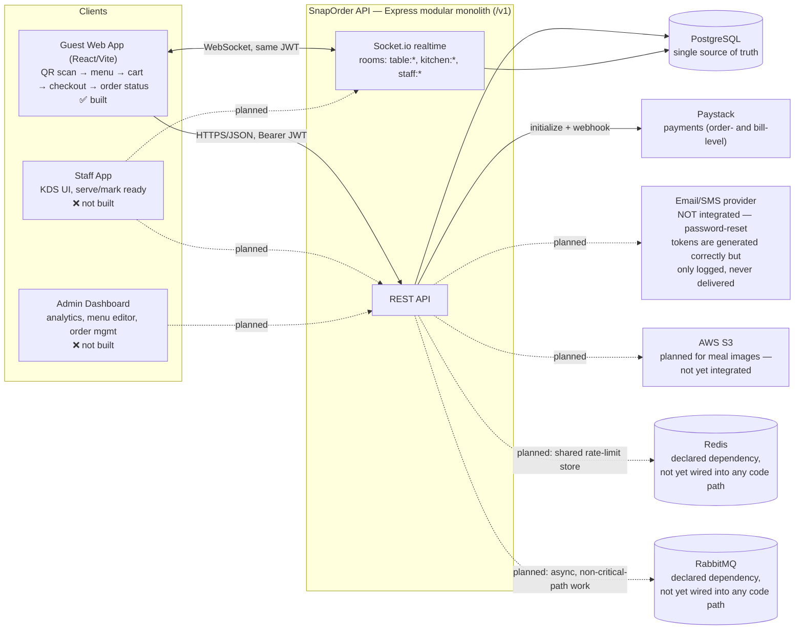
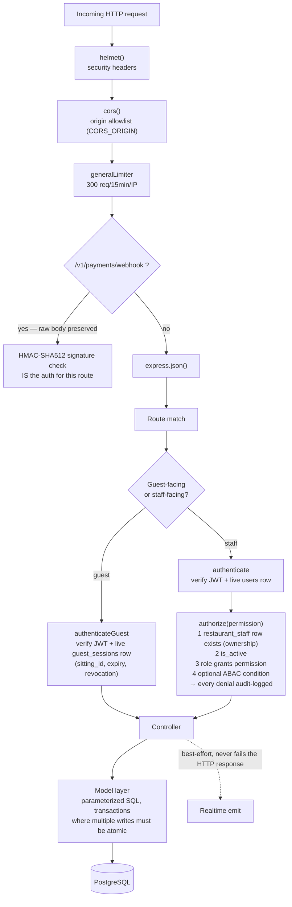

# SnapOrder — Architecture

Companion to `SNAPORDER_DATABASE_SCHEMA.md` (full schema), `SNAPORDER_API_CONTRACTS.md` (endpoints), and `SNAPORDER_AUTHORIZATION.md` (RBAC/ABAC/IAM/PAM model). This file is the shape of the system; those are the detail. Update the diagrams here when a real architectural piece changes (a new service, a new client, a queue actually gets wired in) — not for every new endpoint or table, which belong in the docs above instead.

Last updated: 2026-09-21

---

## High-level architecture

**Why Redis/RabbitMQ are dashed:** both are real Docker services in `docker-compose.yml` and real npm dependencies, but no code path actually uses either one yet. Rate limiting (`middleware/rateLimit.js`) is in-memory today — fine for one instance, and Redis is the documented upgrade path *if* this ever runs as more than one. Nothing currently needs an async queue; `engineering-practices` calls for RabbitMQ over synchronous calls for non-critical-path work (notifications, emails) once that work exists. Don't remove either from `docker-compose.yml` on the assumption they're unused — they're provisioned ahead of the features that will need them.

**Single deployable unit:** frontend and backend are separate apps (separate Dockerfiles, separate origins in dev), but the backend itself is one Express process — a deliberate modular monolith (`engineering-practices`), not microservices. Split into services only when there's a concrete, proven need (independent scaling, genuinely distinct hardware profiles), not speculatively.

---

## Low-level architecture — request pipeline

**Route file styles, by history, not by current preference:** the controller/model split (`routes/ → controllers/ → models/`) is the default for anything new; five legacy route files (`auth.js` for register/login, `staff.js`, `guestSession.js`, `restaurantOrders.js`, `tables.js`) stay flat (query `pool` directly) because touching them wasn't asked for when the split became the default — not because flat is still preferred. `routes/auth.js`'s newer endpoints (refresh, reset, MFA) followed the split for their persistence (`models/authModel.js`) while keeping the route handlers themselves inline, consistent with how that file already worked.

---

## Identity types and their enforcement paths

Three distinct identity types, each with its own token type and its own middleware — deliberately never sharing a code path (see `SNAPORDER_AUTHORIZATION.md` Part 0 and 4):

| Identity | Token | Middleware | Backed by |
|---|---|---|---|
| Guest | JWT, `type: 'guest'`, short-lived (4h) | `authenticateGuest` | `guest_sessions` row (proximity-gated at issuance, re-verified every 3 min via heartbeat) |
| Staff | JWT, minimal (`sub` only) | `authenticate` + `authorize(permission)` | `users` + `restaurant_staff` (role resolved fresh every request, never trusted from the token) |
| System Admin | Same staff JWT | `authenticate` + `requirePlatformAdmin(permission)` | `platform_admins` (separate table, not a `restaurant_staff` role) |

A fourth, short-lived token type exists purely as an interstitial step: an MFA challenge (`type: 'mfa_challenge'`, 5 min) issued by `/login` when `users.mfa_enabled` is true, redeemed by `/mfa/verify-login` for a real access+refresh pair. It can't be used anywhere else — `authenticate`/`authenticateGuest` both reject a token whose `type` doesn't match what they expect.

Refresh tokens (`refresh_tokens` table) are opaque, DB-backed, and rotated on every use — closer in spirit to a session row than a JWT, for the same reason `guest_sessions` is a real row: revocation (logout, a password reset) has to take effect immediately, which a purely stateless long-lived token could never do.

---

## Domain entities, grouped by concern

Full column-level detail lives in `SNAPORDER_DATABASE_SCHEMA.md` — this is the map, not the territory.

- **Identity/access:** `users`, `restaurant_staff`, `platform_admins`, `refresh_tokens`, `password_reset_tokens`, `audit_log`
- **Restaurant setup:** `restaurants`, `tables`, `menus`, `meal_categories`, `meals`, `ingredients`, `meal_ingredients`, `meal_addons`, `shifts`, `table_assignments`
- **Guest identity:** `guest_profiles` (per-restaurant, phone-keyed), `guest_sessions` (per-visit, proximity-gated), `guest_visits` (schema exists, not yet populated — see `SNAPORDER_STATUS.md`)
- **Ordering:** `table_sittings`, `orders`, `order_items`
- **Billing/payments:** `bills`, `bill_splits`, `bill_split_shares`, `payment_transactions`, `staff_calls`
- **Feedback (schema only, zero routes):** `guest_reviews`, `restaurant_responses`, `feature_suggestions`, `suggestions_votes`

---

Related: `SNAPORDER_STATUS.md` (what's actually built vs. planned, and the phased roadmap), `SNAPORDER_DATABASE_SCHEMA.md`, `SNAPORDER_API_CONTRACTS.md`, `SNAPORDER_AUTHORIZATION.md`.
